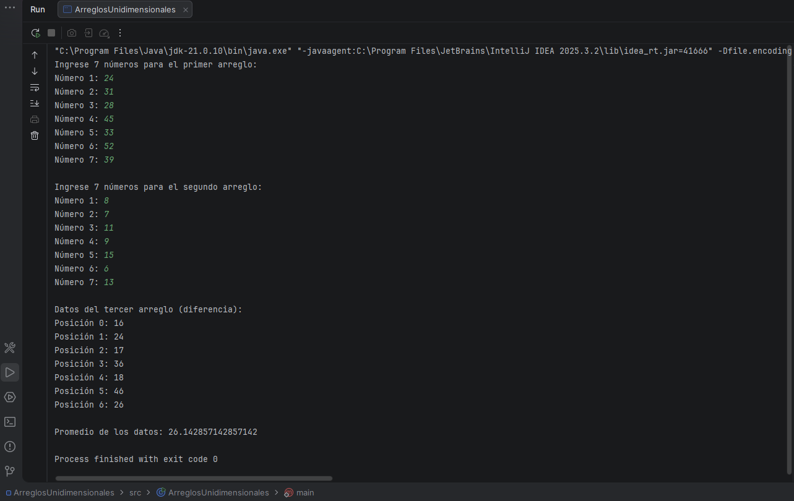

# ACTIVIDAD 1.1
# Operaciones con Arreglos Unidimensionales en Java

**Estudiante:** Leyniker Ferley Celis

---

## Objetivo del proyecto

Desarrollar un programa en Java que utilice **arreglos unidimensionales** para almacenar y procesar datos ingresados por el usuario.

El programa solicita **7 números para dos arreglos**, calcula la **diferencia entre ellos en un tercer arreglo**, muestra sus valores y calcula el **promedio de los resultados**.

---

## Instrucciones de ejecución

1. Abrir el proyecto en **IntelliJ IDEA**.
2. Ubicar el archivo:

```
ArreglosUnidimensionales.java
```

3. Ejecutar el programa presionando **Run ▶** o haciendo clic derecho y seleccionando:

```
Run 'ArreglosUnidimensionales.main()'
```

4. Ingresar los números solicitados en la consola.

El programa mostrará **los valores del tercer arreglo y su promedio**.

---

## Captura de pantalla de la ejecución



---

